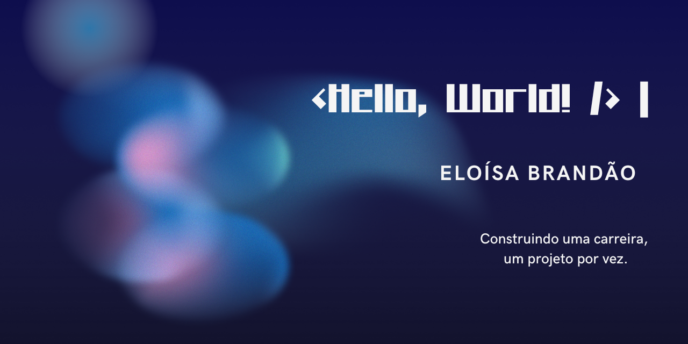

  

# Olá! Eu sou a Eloísa 👋

Sou estudante de **Análise e Desenvolvimento de Sistemas** e estou construindo meu portfólio enquanto exploro diferentes áreas do desenvolvimento de software.

Gosto de aprender na prática, transformando conhecimento em projetos que refletem minha evolução. Atualmente estou desenvolvendo minhas habilidades em programação, versionamento de código e desenvolvimento web, sempre buscando escrever um código mais limpo, organizado e de fácil manutenção.

---

## 🎓 Sobre mim

Acredito que aprender vai muito além de concluir cursos. Por isso, procuro colocar em prática tudo o que estudo, documentando minha evolução por meio de projetos, experimentos e desafios pessoais.

Meu objetivo é construir uma base sólida antes de escolher uma especialização dentro do desenvolvimento de software.

---

## 📚 Atualmente estudando

- HTML5
- CSS3
- JavaScript
- Git
- GitHub
- Lógica de Programação

---

## 🛠 Tecnologias

*Em breve.*

---

## 🎯 Objetivos

- Construir um portfólio sólido.
- Evoluir como desenvolvedora por meio de projetos práticos.
- Contribuir para projetos open source.
- Conquistar minha primeira oportunidade na área de tecnologia.

---

## 📌 Projetos em destaque

🚧 Em construção.

Em breve esta seção será preenchida com os projetos que estou desenvolvendo durante minha jornada de aprendizado.

---

## 📫 Contato
